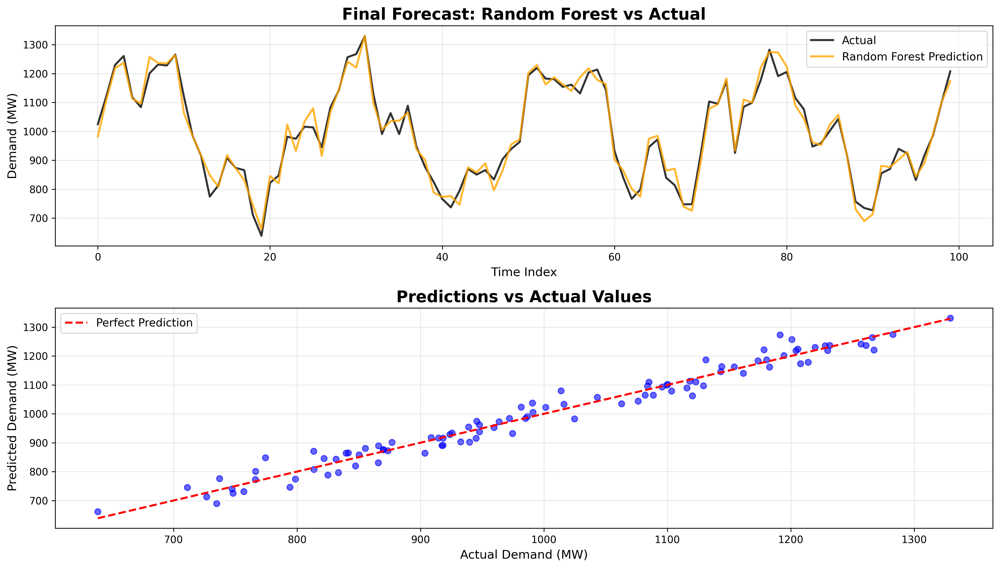

# ⚡ Electricity Load Forecasting using Machine Learning

<div align="center">


[](https://www.python.org/downloads/)
[](https://jupyter.org/)
[](LICENSE)
[](https://www.kaggle.com/datasets/robikscube/electricity-load-forecasting)

</div>

> **Accurate electricity demand prediction using advanced ML techniques to support grid reliability and resource optimization.**

## 🎯 Project Overview

This project demonstrates **machine learning-based electricity load forecasting** using historical consumption data, weather variables, and temporal features. The goal is to build predictive models that accurately estimate short-term electricity demand, which is crucial for:

- **Grid Stability** - Preventing blackouts and maintaining power quality
- **Resource Planning** - Optimizing power generation and distribution
- **Cost Optimization** - Reducing operational expenses and energy waste
- **Renewable Integration** - Better planning for variable renewable sources

## 📊 Dataset

- **Source:** [Kaggle - Electricity Load Forecasting](https://www.kaggle.com/datasets/robikscube/electricity-load-forecasting)
- **Size:** ~500,000+ records with hourly granularity
- **Features:**
  - **Temporal:** Date, time, day of week, month, weekend/holiday indicators
  - **Weather:** Temperature (T2M), humidity (QV2M), wind speed (W2M)
  - **Historical:** Lag features, rolling averages, moving window statistics
  - **Target:** Electricity demand (DEMAND) in MW

## 🛠️ Technology Stack

- **Language:** Python 3.8+
- **ML Framework:** Scikit-learn
- **Data Processing:** Pandas, NumPy
- **Visualization:** Matplotlib, Seaborn
- **Notebook:** Jupyter
- **Version Control:** Git

## 🚀 Key Features & Techniques

### 🔧 **Advanced Feature Engineering**
- **Cyclic Encoding** - Hour, day, month converted to cyclical features
- **Lag Features** - Previous demand values for temporal dependency
- **Rolling Statistics** - Moving averages and standard deviations
- **Weather Integration** - Temperature and environmental variables

### 🤖 **Machine Learning Models**
- **Linear Regression** - Baseline model for comparison
- **Decision Tree** - Non-linear pattern capture
- **Random Forest** - Ensemble learning with feature importance analysis

### 📈 **Performance Metrics**
- **R² Score** - Coefficient of determination
- **RMSE** - Root Mean Square Error
- **MAE** - Mean Absolute Error

## 🏆 Results

| Model | R² Score | RMSE | MAE |
|-------|----------|------|-----|
| **Random Forest** | **0.98** | **25.72** | **14.35** |
| Decision Tree | 0.97 | 30.23 | 18.28 |
| Linear Regression | 0.90 | 58.71 | 45.51 |

### 🎯 **Key Achievements**
- **98% accuracy** with Random Forest model
- **Significant improvement** over baseline (Linear Regression)
- **Robust feature importance** analysis for interpretability
- **Efficient handling** of large-scale time series data

## 📊 Results Visualization

### Model Performance Comparison


*Comparison of Linear Regression, Decision Tree, and Random Forest predictions against actual electricity demand values. Random Forest shows the best performance with 98% accuracy.*

### Feature Importance Analysis


*Random Forest feature importance ranking showing that temporal features (hour of day, day of week) are most critical for accurate demand forecasting.*

### Predictions vs Actual Values


*Time series comparison and scatter plot showing Random Forest predictions vs actual demand values, demonstrating excellent model performance.*

### Demand Pattern Analysis


*Analysis of electricity demand patterns across daily, weekly, and monthly cycles, plus demand distribution for better understanding of consumption behavior.*

## 🚀 Getting Started

### Prerequisites
- Python 3.8+
- Jupyter Notebook or JupyterLab
- Required packages (see `requirements.txt`)

### Quick Start

1. **Clone the repository**
   ```bash
   git clone https://github.com/yourusername/electricity-load-forecasting.git
   cd electricity-load-forecasting
   ```

2. **Install dependencies**
   ```bash
   pip install -r requirements.txt
   ```

3. **Run on Kaggle**
   - Upload `load-forecasting-project.ipynb` to [Kaggle Notebooks](https://www.kaggle.com/code)
   - Add the [Electricity Load Forecasting dataset](https://www.kaggle.com/datasets/robikscube/electricity-load-forecasting)
   - Run all cells to reproduce results

4. **Run locally**
   - Download the dataset from Kaggle
   - Update file paths in the notebook
   - Execute: `jupyter notebook load-forecasting-project.ipynb`

## 📁 Repository Structure

```
electricity-load-forecasting/
├── 📓 load-forecasting-project.ipynb    # Main Jupyter notebook
├── 📋 requirements.txt                   # Python dependencies
├── 📖 README.md                         # Project documentation
├── 📊 results/                          # Generated plots and results
│   ├── model_comparison.png
│   ├── feature_importance.png
│   └── predictions_vs_actual.png
├── 📁 data/                             # Dataset files (not included)
└── 🔧 .gitignore                        # Git ignore rules
```

## 🔍 Model Insights

### **Feature Importance Analysis**
The Random Forest model reveals that **temporal features** are most critical:
- **Hour of day** - Captures daily consumption patterns
- **Day of week** - Weekly seasonality effects
- **Weather variables** - Temperature correlation with demand
- **Lag features** - Temporal dependencies in consumption

### **Seasonal Patterns**
- **Daily cycles** - Peak demand during business hours
- **Weekly patterns** - Lower consumption on weekends
- **Holiday effects** - Reduced demand during special days

## 🎓 Key Learnings

1. **Feature Engineering is Crucial** - Temporal and weather features significantly improve model performance
2. **Ensemble Methods Excel** - Random Forest outperforms individual models through variance reduction
3. **Data Quality Matters** - Clean, well-structured data leads to better predictions
4. **Interpretability Counts** - Feature importance analysis provides valuable business insights

## 🚀 Next Steps

- [ ] **Deep Learning Models** - Implement LSTM/GRU for sequence modeling
- [ ] **Real-time Forecasting** - Build API for live predictions
- [ ] **Feature Selection** - Automated feature selection using SHAP values
- [ ] **Model Deployment** - Containerize and deploy to cloud platforms
- [ ] **Ensemble Methods** - Stack multiple models for improved accuracy

## 🤝 Contributing

Contributions are welcome! Please feel free to submit a Pull Request. For major changes, please open an issue first to discuss what you would like to change.

## 📄 License

This project is licensed under the MIT License - see the [LICENSE](LICENSE) file for details.

## 🙏 Acknowledgments

- **Kaggle** for providing the comprehensive dataset
- **Scikit-learn** team for excellent ML tools
- **Open source community** for continuous improvements

---

<div align="center">
  <p><strong>⭐ Star this repository if you found it helpful!</strong></p>
  <p>Built with ❤️ for the energy forecasting community</p>
</div>
